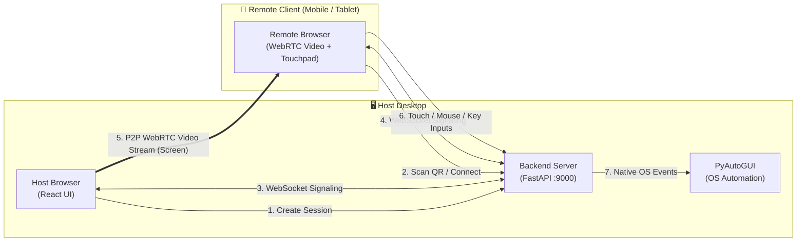

# 🖥️ QuickDesk

<div align="center">

**Lightweight, Zero-Config WebRTC Remote Desktop & Screen Control via Instant QR Code Pairing**

[](https://www.python.org/)
[](https://fastapi.tiangolo.com/)
[](https://react.dev/)
[](https://webrtc.org/)
[](https://pyautogui.readthedocs.io/)
[](LICENSE)
[](CONTRIBUTING.md)

[Quick Start](#-quick-start-in-1-minute) • [Features](#-key-features) • [Usage Guide](#-usage-walkthrough) • [Architecture](#%EF%B8%8F-architecture--how-it-works) • [Documentation](docs/)

</div>

---

## 🌟 Overview

**QuickDesk** is an open-source, high-performance remote desktop support tool. It enables instant desktop screen sharing and bidirectional remote control from **any device with a web browser** (smartphones, tablets, laptops) simply by **scanning a QR code**.

No client software or mobile app installation is required on the remote viewer's side. Everything runs seamlessly in modern browsers via native **WebRTC peer-to-peer streaming** and **FastAPI WebSocket signaling**, backed by **PyAutoGUI** for responsive OS automation.

---

## ✨ Key Features

- 📱 **Instant QR Code Pairing**: Generate a session on your desktop, point your phone's camera at the QR code, and you are connected in seconds.
- ⚡ **Ultra Low-Latency WebRTC Streaming**: Streams your desktop display peer-to-peer at high frame rates with sub-50ms latency over local networks.
- 🖱️ **Full Remote Desktop Control**: Real-time mouse movement, left/right clicks, dragging, double-clicking, scrolling, and keyboard keystrokes via PyAutoGUI.
- 📱 **Mobile-Optimized Touch Controls**:
  - Virtual trackpad with smooth cursor movement.
  - On-screen touch gestures (tap to click, two-finger right click).
  - Virtual keyboard for mobile devices and quick-action shortcuts (Enter, Esc, Windows Key, Tab).
- 🌐 **Unified Single-Port Architecture**: The FastAPI backend serves the REST API, WebSocket signaling, and pre-built React frontend all on a single port (`9000`). Perfect for free, single-tunnel ngrok or local LAN sharing.
- 🔒 **Granular Security & Permissions**:
  - Enable/disable mouse control, keyboard input, clipboard sync, or file transfer per session.
  - Ephemeral cryptographically random session tokens.
  - Automatic session expiration with configurable TTL (default: 5 minutes).
  - Built-in PyAutoGUI fail-safe (slam mouse to screen corner to abort).
- 🚀 **Zero-Config LAN Auto-Discovery**: Automatically detects your host machine's LAN IP address and bakes it into the QR code.

---

## 🏗️ Architecture & How It Works



For complete technical specifications, see the [Architecture Document](docs/ARCHITECTURE.md).

---

## 🚀 Quick Start in 1 Minute

### Prerequisites
- **Python 3.10+** installed on the host desktop.
- Any modern web browser (Chrome, Edge, Firefox, Safari) on both host and remote devices.
- *(Optional)* Node.js 18+ (only needed if you want to rebuild or modify the frontend).

---

### Option A: One-Click Launchers (Easiest)

#### On Windows:
Double-click **`start_quickdesk.bat`** (or run it from PowerShell/CMD):
```cmd
start_quickdesk.bat
```

#### On Linux / macOS:
```bash
chmod +x start_quickdesk.sh
./start_quickdesk.sh
```

The script will automatically check dependencies, start the unified server on port `9000`, and open your browser!

---

### Option B: Manual Setup

1. **Clone the repository**:
   ```bash
   git clone https://github.com/your-username/quickdesk.git
   cd quickdesk
   ```

2. **Set up a Python Virtual Environment**:
   ```bash
   python -m venv venv
   
   # Windows:
   venv\Scripts\activate
   # Linux/macOS:
   source venv/bin/activate
   ```

3. **Install Dependencies**:
   ```bash
   pip install -r backend/requirements.txt
   ```

4. **Run QuickDesk**:
   ```bash
   python backend/run.py
   ```

5. Open your browser at **`http://localhost:9000`**.

---

## 📖 Usage Walkthrough

### 1. Host Mode (Sharing Your Desktop)
1. Open `http://localhost:9000` on your desktop.
2. Select **"Host"** mode.
3. Choose your session duration (e.g. 5 minutes) and permissions (enable **Mouse Control** and **Keyboard Control** if you want remote assistance).
4. Click **"Create Session"**. Your browser will ask you to select which screen or window to share.
5. A unique QR code and connection link will appear on screen.

### 2. Remote User Mode (Controlling from Phone / Tablet)
1. Open the camera app on your phone or tablet and **scan the QR code** displayed on the host screen.
   *(Or click the direct URL link)*.
2. Your phone's browser will open the QuickDesk control interface directly.
3. You will immediately see the host's screen live!
4. **Controls**:
   - **Move Cursor**: Drag your finger across the virtual trackpad or screen.
   - **Click**: Tap the trackpad or click the left mouse button.
   - **Right Click**: Tap with two fingers or use the right mouse button.
   - **Scroll**: Use the on-screen scroll bar or two-finger swipe.
   - **Type**: Tap the keyboard icon to open the virtual keyboard or send keystrokes.

---

## 🌐 Connecting Over the Internet (ngrok / Cloudflare)

By default, QuickDesk works on your **local Wi-Fi / LAN**. If you want to assist someone over the internet:

### Using ngrok (Free, 1 Tunnel):
1. Start your tunnel:
   ```bash
   ngrok http 9000
   ```
2. Set the `PUBLIC_APP_URL` environment variable to your ngrok URL:
   ```bash
   # Windows PowerShell:
   $env:PUBLIC_APP_URL="https://your-domain.ngrok-free.dev"
   python backend/run.py

   # Linux/macOS:
   export PUBLIC_APP_URL="https://your-domain.ngrok-free.dev"
   python3 backend/run.py
   ```
3. Now all QR codes and connection links automatically point to your public ngrok address!

For Cloudflare Tunnels, systemd service setup, and reverse proxies, see the [Deployment Guide](docs/DEPLOYMENT_GUIDE.md).

---

## 📂 Project Structure

```text
quickDesk_Scan/
├── backend/
│   ├── app/
│   │   ├── core/              # Session, WebRTC & WebSocket managers
│   │   ├── models/            # Pydantic data schemas
│   │   ├── utils/             # Security, token generation & IP detection
│   │   ├── database.py        # SQLAlchemy models (async SQLite)
│   │   └── main.py            # FastAPI app, signaling & static mount
│   ├── .env.example           # Backend environment configuration template
│   ├── requirements.txt       # Python dependencies
│   ├── run.py                 # Backend entry point (Port 9000)
│   └── test_api.py            # API endpoint integration test suite
├── frontend/
│   ├── build/                 # Pre-built React bundle (served on port 9000)
│   ├── public/                # HTML template & icons
│   ├── src/
│   │   ├── components/
│   │   │   ├── Host/          # Host dashboard & session creation
│   │   │   └── Remote/        # QR scanner, WebRTC viewer & touch controls
│   │   ├── services/api.js    # Axios API & WebSocket helpers
│   │   ├── App.js             # Root routing (Host vs Remote /connect)
│   │   └── index.js
│   ├── .env.example           # Frontend environment configuration template
│   └── package.json           # React dependencies & scripts
├── docs/
│   ├── ARCHITECTURE.md        # Deep dive into WebRTC & internal design
│   ├── API_REFERENCE.md       # Full REST API & WebSocket message specs
│   └── DEPLOYMENT_GUIDE.md    # LAN, ngrok, Cloudflare & Linux VPS guide
├── start_quickdesk.bat        # Windows one-click launcher
├── start_quickdesk.sh         # Linux / macOS one-click launcher
├── .gitignore                 # Git ignore rules (protects .env & secrets)
├── CONTRIBUTING.md            # Guidelines for open-source contributors
├── CODE_OF_CONDUCT.md         # Contributor Covenant v2.1
├── SECURITY.md                # Security policy & vulnerability reporting
├── LICENSE                    # MIT License
└── README.md                  # Project documentation & overview
```

---

## ⚙️ Configuration Reference

Create a `backend/.env` file (copied from `backend/.env.example`) to customize settings:

| Variable | Default | Description |
| -------- | ------- | ----------- |
| `DATABASE_URL` | `sqlite+aiosqlite:///./quickdesk.db` | Async database connection string. |
| `SECRET_KEY` | `your-secret-key-here` | Secret key for session token generation. |
| `PUBLIC_APP_URL` | `http://<lan-ip>:9000` | Base URL embedded in QR codes. Override for ngrok / domain. |
| `DEBUG` | `True` | FastAPI debug mode. |
| `PORT` | `9000` | Port for the unified server. |

---

## 🚨 Security & Emergency Failsafe

- **PyAutoGUI Failsafe**: If mouse automation acts unexpectedly, **slam the physical mouse into any corner of the screen** (top-left, top-right, bottom-left, bottom-right). This triggers PyAutoGUI's built-in emergency interrupt.
- **Terminate Session**: Click the red **"Terminate Session"** button on the Host Dashboard to instantly disconnect all remote users and invalidate session tokens.
- **Permissions First**: Remote users have **no control** over your keyboard or mouse unless you explicitly enable those permissions when creating the session.

For detailed security policies, see [SECURITY.md](SECURITY.md).

---

## 🧪 Testing

Run the automated API test suite:
```bash
python backend/test_api.py
```

---

## 📚 In-Depth Documentation

- 🏛️ [System Architecture & WebRTC Signaling](docs/ARCHITECTURE.md)
- 🔌 [REST API & WebSocket Protocol Reference](docs/API_REFERENCE.md)
- 🚀 [Deployment & Networking Guide (LAN / ngrok / VPS)](docs/DEPLOYMENT_GUIDE.md)

---

## 🤝 Contributing

Contributions are welcome! Please read [CONTRIBUTING.md](CONTRIBUTING.md) and our [Code of Conduct](CODE_OF_CONDUCT.md) before opening a pull request.

---

## 📄 License

This project is licensed under the **MIT License** - see the [LICENSE](LICENSE) file for details.
